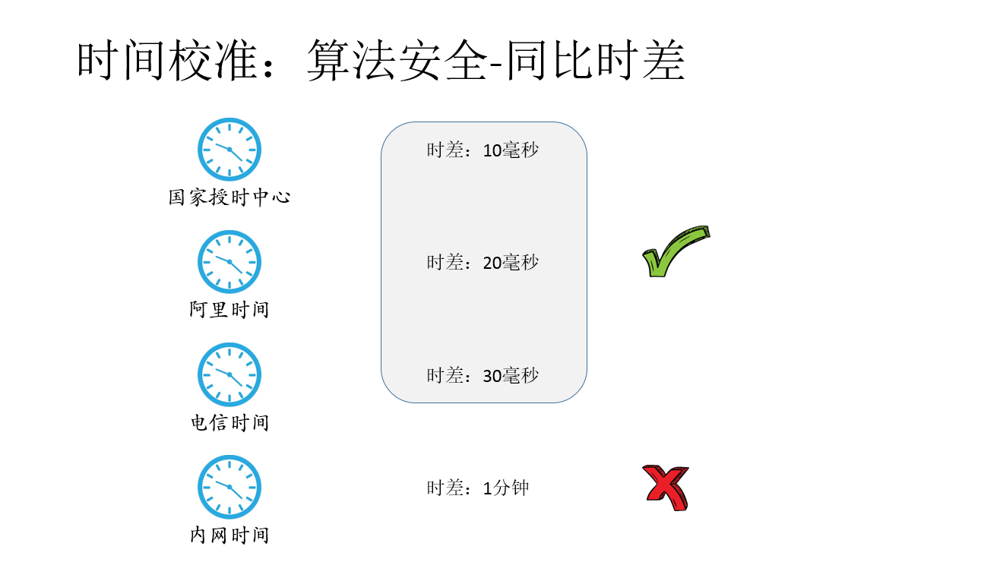
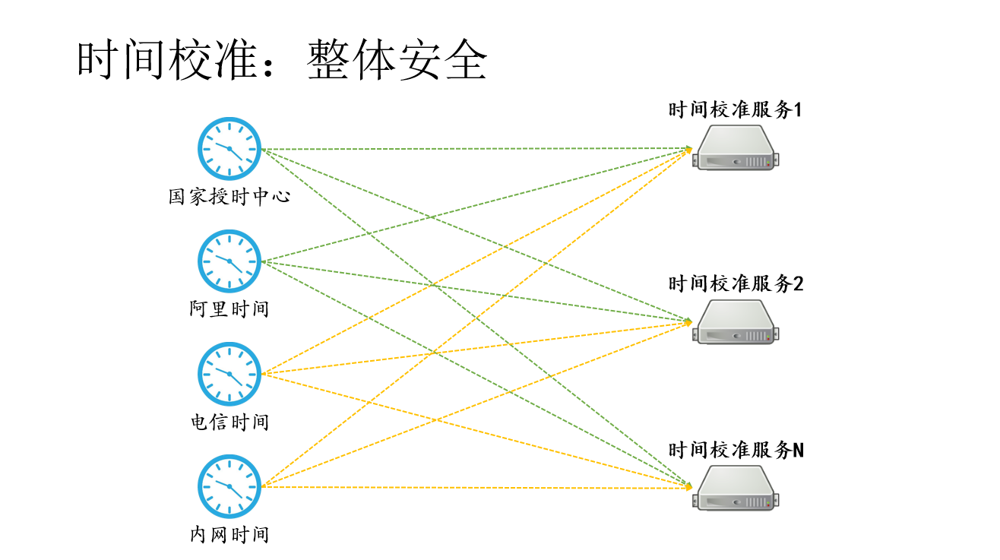

# hy.microservice.monitor 监控服务

## 时间校准

### 网络安全

### 算法安全-同比时差

### 算法安全-顺序优先

### 算法安全-历史不倒退

### 算法安全-环比历史

### 算法安全-算法优选

### 整体安全

## 主机资源预警
通过周期定时收集主机运行时的信息，并将其记录在数据库中备查。通过Drools规则引擎向外界提供，可配可调整的预警规则，如预警方式（短信、微信）、预警时间、预警人员和预警内容的配置规则。

预警内容可定制，不仅限于CPU、内存、磁盘空间。

### 硬盘空间预警

### CPU预警

### 内存预警

## 主机任务调度
通过周期定时执行操作系统的任务，如定时执行Dos命令、Linux命令等。

命令由终端用户自行编写。一般常用的任务有，清理Tomcat过期日志、清理Oracle过期归档日志等。

## 部署文档

[下载](./hy.microservice.monitor/doc/OpenDoc.操作说明-监控服务.docx)